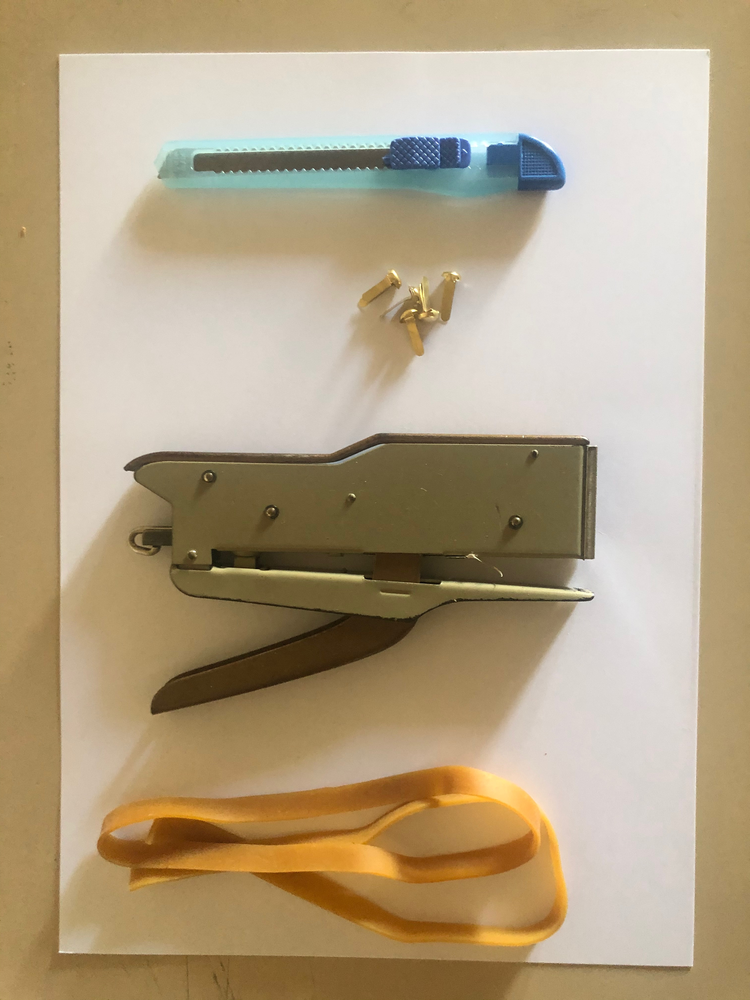
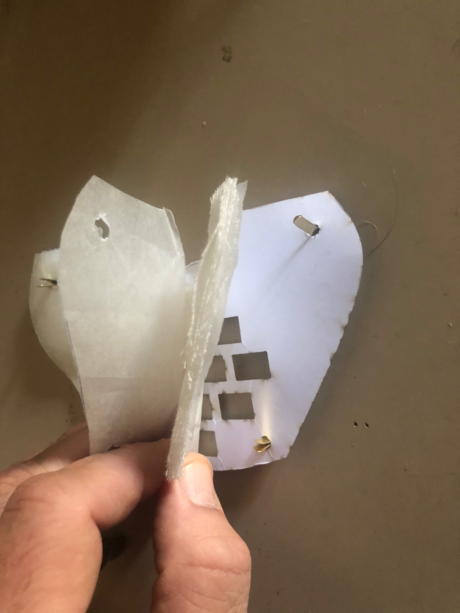
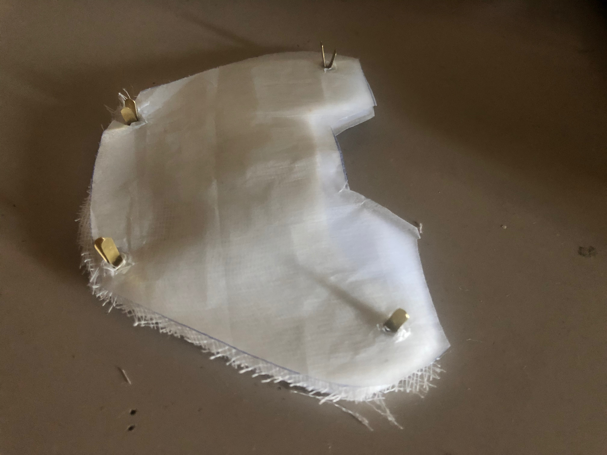
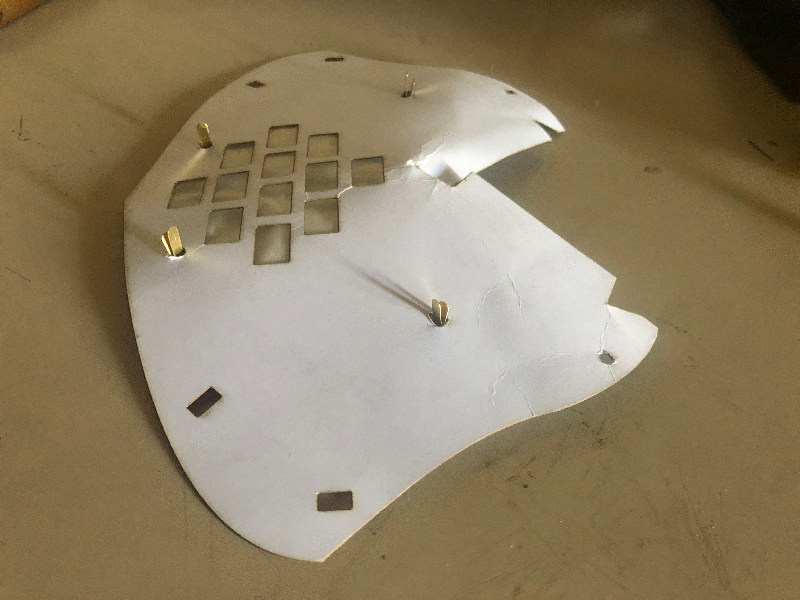
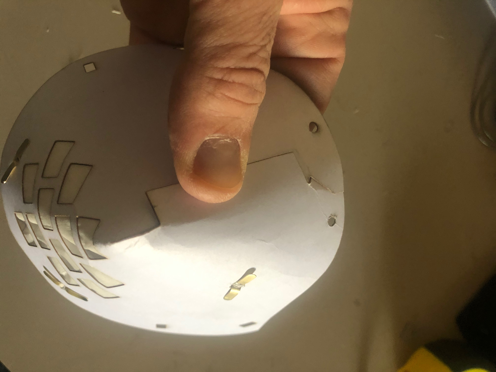
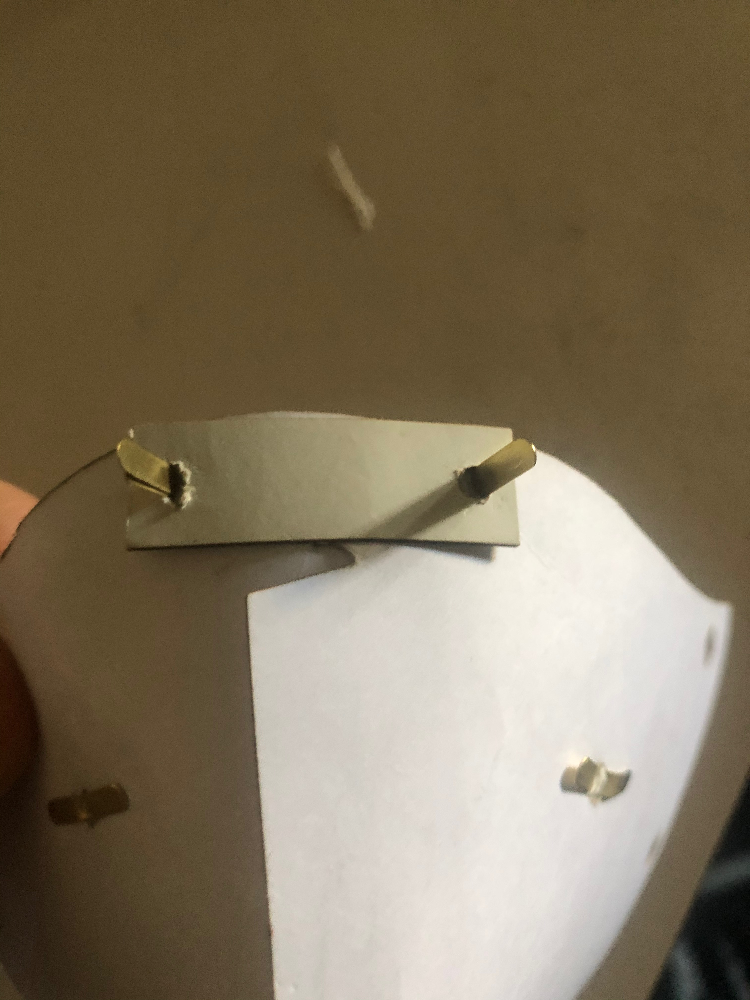
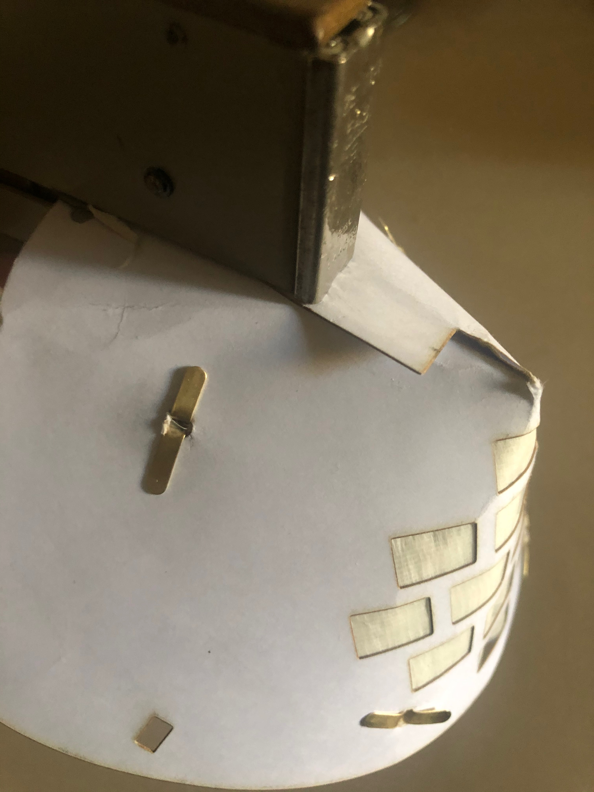
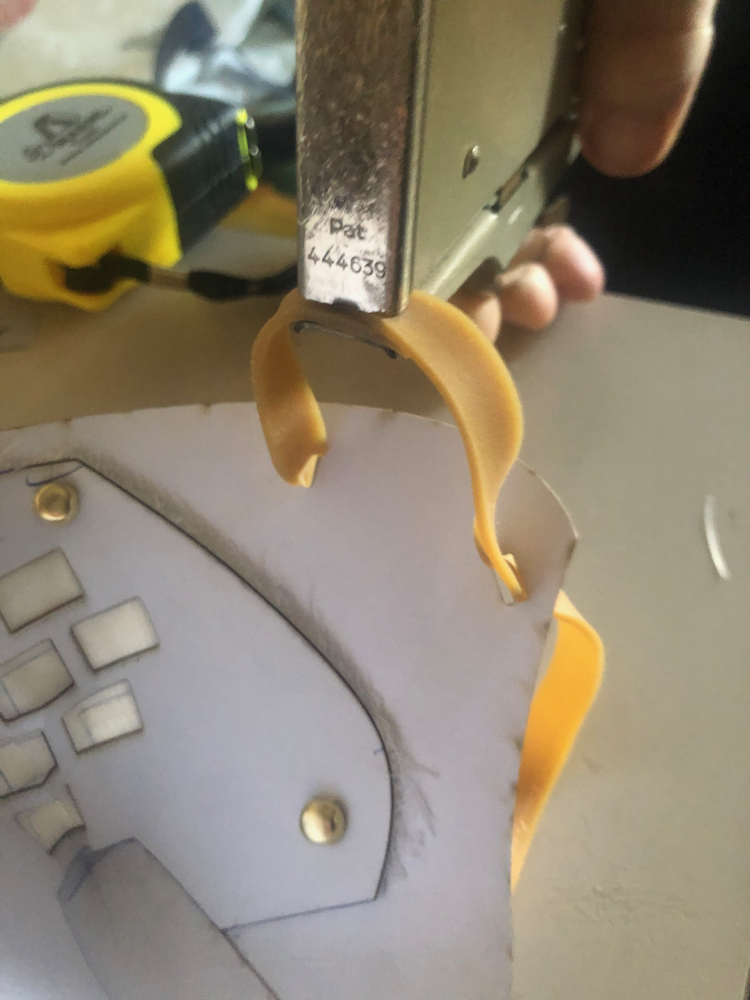
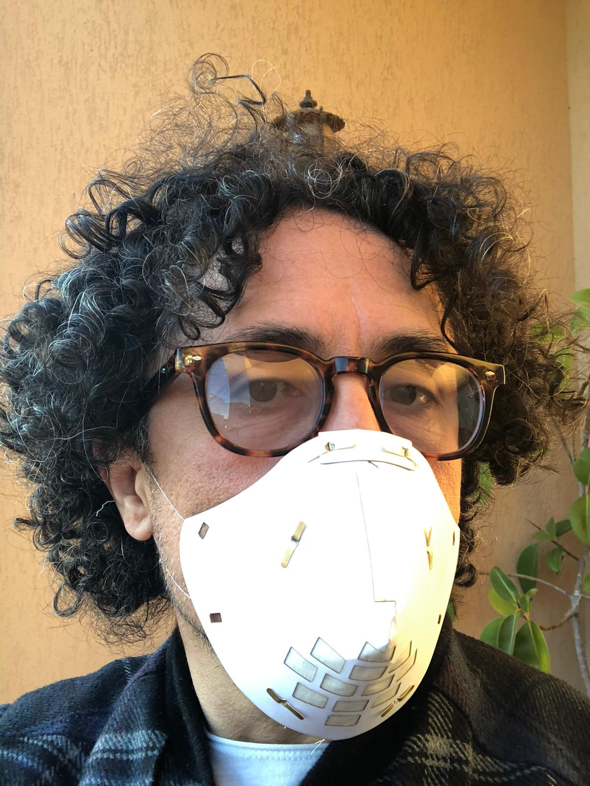

#### DIY Corvid-19 mask

This is not my work, it has been taken from https://mask-id.web.app/EN.html since his web site is getting the hug of death

All attribution goes to Gianpaolo Montagna Design Studio

I am only looking to host this on github for easy access to a wider audience


##### Below are the contents of the website

DIY face-mask in the time of COVID-19

In this period one of the greatest difficulties is finding protective masks, that's why people are making diy masks. As a Designer I decided to develop a low cost and easy to build mask, that have a low environmental impact too.

```
Repo specific
The PDF in this directory has the cutouts
The 3d Printer files are in the folder
``` 

###### Material

    1 A4 300g/m2 cardboard
    6 paper brass fastener
    2 elastic bands 28/30 cm long
    Filter material (sterile gauze, baking paper, swiffer, panty liners, cotton from old shirts... etc)
    1 stapler
    1 cutter



###### Instructions

    * Print the mask model, cut out the 3 parts and use them as templates to cut the cardboard.
    * Make holes on all the crossed cardboard parts.
    * By using the piece n.2 cuts the material found for the filter part of the same shape and creates a sandwich. I made 3 layers, baking paper - sterile gauze paper - baking paper. Block the filter layers by stapling the edges.



    * Put paper brass fastener on piece n2 and leave the flaps upwards.
    * Repeat the same operation for the filter part already made. 



    * In the same way overlap the piece n. 1 and close the flaps.



    * Overlap flap “a” on flaps “b” and “c”, and put it under “d”.




    * Secure piece n.3 and place a by stapling the central part of the nose.




    * Insert the ends of the elastic into the holes and join them together.



    * Enjoy


